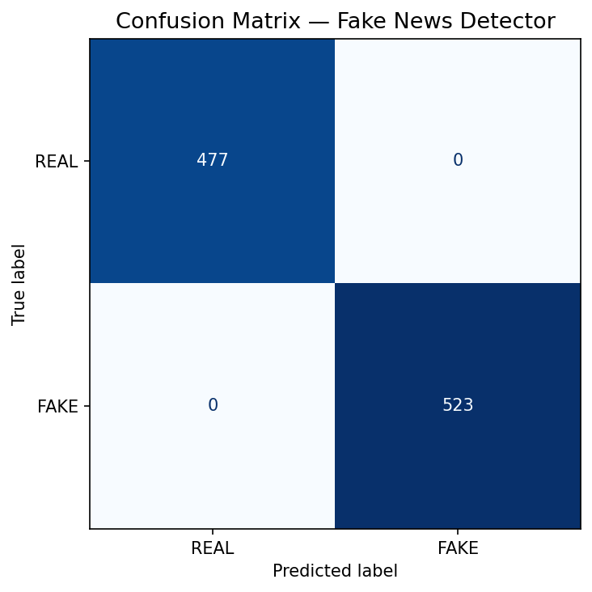

# Fake News Detector

A machine learning web app that classifies news articles as **real or fake** using a fine-tuned DistilBERT transformer model.

## Live Demo
[**Try it here →**](https://fake-news-detector-impactcircle.streamlit.app/)
**App URL:** https://fake-news-detector-impactcircle.streamlit.app
---

## Results


| Metric | Score |
|--------|-------|
| Accuracy | 99.7% |
| F1 Score | 0.997 |
| Precision | 0.997 |
| Recall | 0.997 |
| Training Samples | 116,000+ |

---

## Features

- Paste any news headline or full article text
- Paste a URL to automatically scrape and analyze
- Confidence score with real/fake probability breakdown
- Dark mode / Light mode toggle
- Low confidence warning for uncertain predictions
- Works on both US and Indian English news

---

## Tech Stack

| Component | Technology |
|-----------|------------|
| Model | DistilBERT (fine-tuned) |
| ML Framework | HuggingFace Transformers + PyTorch |
| Frontend | Streamlit |
| Model Hosting | HuggingFace Hub |
| App Hosting | Streamlit Cloud |
| Training Platform | Kaggle (T4 GPU) |

---

## Dataset

Trained on **116K+ labeled news articles** combining:

- **WELFake Dataset** — 72,134 articles
- **ISOT Fake News Dataset** — 44,898 articles
- **Kaggle Fake and Real News Dataset** — 44,898 articles

All datasets deduplicated and class-balanced before training.

---

## Model

Fine-tuned model hosted on HuggingFace:
[**impactcircle/fakenews-distilbert**](https://huggingface.co/impactcircle/fakenews-distilbert)

Label mapping: `0 = REAL`, `1 = FAKE`

---

## Project Structure

```
fake-news-detector/
├── app.py                     # Streamlit web app
├── requirements.txt           # Python dependencies
├── fake_news_detector.ipynb   # Training notebook
└── README.md
```

---

## How to Run Locally

```bash
# Clone the repo
git clone https://github.com/YOUR_USERNAME/fake-news-detector
cd fake-news-detector

# Install dependencies
pip install -r requirements.txt

# Run the app
streamlit run app.py
```

---

## How It Works

1. User inputs a news article or URL
2. Text is tokenized using DistilBERT tokenizer (max 256 tokens)
3. Fine-tuned model outputs probability scores for REAL and FAKE
4. Result shown with confidence percentage

---

## Training Details

- **Base model:** `distilbert-base-uncased`
- **Epochs:** 3
- **Batch size:** 16
- **Learning rate:** 2e-5
- **Hardware:** Kaggle T4 GPU
- **Training time:** ~40 minutes

---

## Limitations

- Best accuracy on English language news
- Lower accuracy on regional Indian corporate and financial news due to domain mismatch with training data
- Does not support non-English languages
- Paywalled websites cannot be scraped via URL input

---

## Author

**Apeksha Agarwal** — 2nd Year AI/ML Student

---

## License

This project is for educational purposes only.
